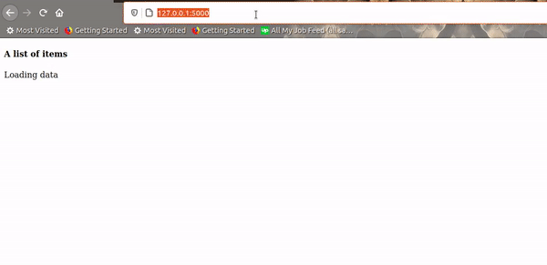

===========
Flask-Wire
===========

Flask-Wire is a Flask extension that brings "HTML over the wire" capabilities to Flask. It is heavily inspired by
Laravel's `Livewire <https://laravel-livewire.com/>`_ and Ruby on Rails' `Hotwire <https://hotwire.dev/>`_

If you haven't heard of "HTML over the wire" before, take a look at `this article <https://m.signalvnoise.com/html-over-the-wire/>`_
to bring you up to speed.

======
Usage
======
To start off, install the package by running ::

    pip install Flask-Wire

Now let's write a simple Flask app to demonstrate the extension in action.

**app.py**

.. code-block:: python

    import time

    from flask import Flask, render_template_string

    from flask_wire import Wire

    def create_app():
        app = Flask(__name__)
        Wire(app)

        @app.route('/')
        def index():
            html = '''
            
            <!DOCTYPE html>
            <html lang="en">
                <head>
                    <meta charset="UTF-8">
                    <title>Example</title>
                    {{ wire.load_js() }}
                </head>
                <body>
                    <h4>A list of items</h4>
                    {{ wire_frame('items_list', initial=url_for('items')) }}
                </body>
            </html>
            '''
            return render_template_string(html)

        @app.route('/items')
        def items():
            html = '''
            <ul>
                <li>Item 1</li>
                <li>Item 2</li>
                <li>Item 3</li>
                <li>Item 4</li>
            </ul>
            '''
            time.sleep(2)  # Delay for two seconds in order to display loader
            return render_template_string(html)

        return app

    if __name__ == '__main__':
        app = create_app()
        app.run(debug=True)

Running the above program produces this:

We didn't have touch a single line of **Javascript** to achieve it :)

================
Available macros
================
wire_frame
^^^^^^^^^^
This macro is responsible for creating the container that will display the HTML delivered over the wire.

Usage

.. code-block:: jinja

    
    {{ wire_frame(id, initial, on_events, error_text, loader_text, frame_classes, error_classes, loader_classes) }}

Besides **id**, all other parameters optional.

If a url is passed to the **initial** parameter, as soon as a page is loader, the frame will fetch data from the url
passed and set it to its body.

The **on_events** takes a list of strings (events). It allows the frame to listen for events and update its body from
the url it last fetched from e.g:

.. code-block:: jinja

    
    {{ wire_frame('test', initial='/someurl', on_events=['data_added']) }}

If a trigger does not change the source of the frame, every time **data_added** is fired, the frame will fetch data
from initial source i.e ``/someurl``

By default, all frames have an error container and a loader container which are displayed if an error occurs or
when fetching data respectively. If you don't want the frame to display them, just pass ``None`` or an empty text to the
**error_text** or **loader_text** parameters.

``frame_classes``, ``error_classes``, ``loader_classes`` are for styling the body, the error body and the loader of the frame,
respectively.

wire_trigger
^^^^^^^^^^^^
The ``wire_trigger`` is basically an ```` tag that changes the source of a frame without reloading the page.

Usage

.. code-block:: jinja

    
    {{ wire_trigger(target, source, text, persist, extra_classes) }}

**Required**: ``target``, ``source``, ``text``

``target`` - This is the id of the frame to change. A frame with that **id** must exists in the DOM.

``source`` - This is a url where the target frame will fetch its data from. **Note** Once a frame's source of data is
changed, it becomes the new default source for the frame.

``text`` - This is the inner text of the ``<a>`` tag

When the **persist** is set to ``True``, the url passed into **source** is pushed into the browser history. It's **False**
by default since most times you won't need to update the browser history with the url of a small section of a page.

``extra_classes`` are for styling the ``<a>`` tag.

wire_mutation
^^^^^^^^^^^^^
Unlike the **wire_frame** and **wire_trigger** macros, the wire_mutation macro does not generate a HTML tag. It
basically adds attributes to an existing tag, a ``<form>`` to be specific.

Usage

.. code-block:: jinja

    
    <form method="post" action="" {{ wire_mutation(target, events) }}>
        ...
    </form>

All the parameters of the **wire_mutation** are optional. However, it is recommended to have at least one present,
otherwise the macro offers no functionality.

``target`` - This is the id of thw frame to change i.e When the form is submitted, the body of the target frame is updated
with the response returned from the submission.
``events`` - This is a list of events to fire after a successful submission. This parameter takes a list of strings.

**Note** The ``target`` parameter takes precedence over the ``events`` parameter. If both happen to be provided,
the target will be updated but the events won't be fired.

=================
Behind the scenes
=================
I would be lying if I said all this was achieved without a bit Javascript. Javascript was involved though just **a bit**.